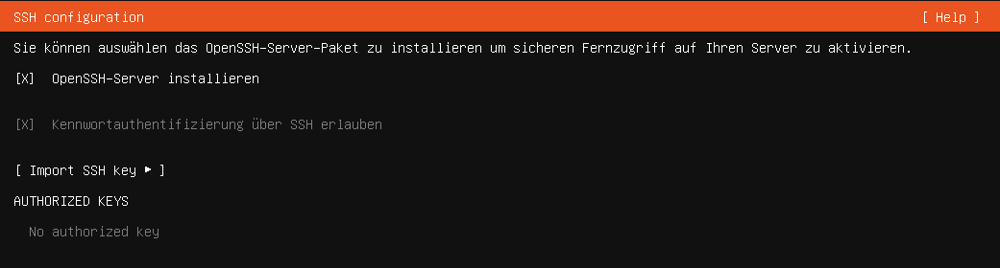

:::::::::::::::::::::::::::::::::::::: questions 

- Wie wähle ich die richtige Hard- und Software aus?

- Wie installiere ich ein Linux-Betriebssystems?

- Wie bediene ich ein Linux-Betriebssystem?

::::::::::::::::::::::::::::::::::::::::::::::::

::::::::::::::::::::::::::::::::::::: objectives

- Begriffsklärung
- Betriebssystem installieren
- Grundlagen mit der Linux-Kommandozeile

::::::::::::::::::::::::::::::::::::::::::::::::

# Die Hard- und Software

## Hardware
Zu Beginn der meisten IT-Projekte steht die Frage, wo diese Projekte umgesetzt werden sollen. Dabei gibt es heutzutage unterschiedliche Möglichkeiten. Abgesehen von Tests auf lokalen Endgeräten wie PC oder Notebook, werden für viele Projekte spezialisierte Geräte genutzt. Vor allem für Firmen, Rechenzentren und andere Hochleistungsszenarien werden Computer mit **spezialisierter Hardware** (Prozessoren, Festplatten, Arbeitsspeicher oder RAID-Controller) eingesetzt, die für diese anspruchsvollen Aufgaben geeignet ist und häufig nicht mit Endanwender-Hardware vergleichbar ist.

Neben eigener Hardware besteht heute auch die Möglichkeit, seine Projekte auf fremder Hardware umzusetzen. Diese fremde Hardware befindet sich in einem **entfernten Rechenzentrum ("der Cloud")** und ist über das Internet erreich- und steuerbar. Häufig wird die Hardware dabei virtualisiert, d.h. dass z.B. die Leistung eines echten Prozessors mithilfe von Software für mehrere virtuelle Computer zur Verfügung gestellt wird.

Für dezentrale Projekte können sogenannte **Embedded Devices** genutzt werden. Hierbei handelt es sich häufig um Spezialanfertigungen für genau einen Einsatzzweck, z.B. als Kassensystem oder Waage im Supermarkt oder als Informationsdisplay im öffentlichen Raum. Für diese Geräte werden auch spezielle Betriebssysteme und Software eingesetzt.

Für kleinere Projekte wie Heimanwender können normale PCs genutzt werden. Passender für Projekte mit wenig Leistungsanspruch (und im Heimanwenderbereich ist das i.d.R. der Fall) sind Mini-PCs, bei denen sämtliche oder die meisten Bauteile (Prozessor, Arbeitsspeicher, Datenspeicher und externe Schnittstellen wie Netzwerk und USB) auf einer Platine verbaut sind. Diese sogenannten **Systems-on-a-Chip (SoC)** haben den Vorteil, dass sie besonders energiesparsam sind, wenig Platz benötigen, keinen oder kaum Lärm verursachen und im Vergleich mit herkömmlichen PCs oder gar professionellen Servern deutlich günstiger sind.

## Server vs. Client
Bezogen auf ihre Funktion innerhalb eines Computernetzwerks werden Geräte unterschiedlich bezeichnet:

1. Client

Klassisches Endgerät wie PC, Notebook oder Smartphone. Hat keine zentralen Aufgaben. Ist ein Client-Gerät ausgefallen, ist das Netzwerk nicht betroffen.

2. Server

Übernimmt als Kommunikationsknotenpunkt zentrale Aufgaben im Netzwerk. Je nach Leistungsbedarf werden spezialisierte Hochleistungshardware, normale PCs oder SoCs genutzt. Fällt ein Server aus, fehlt damit i.d.R. eine zentrale Funktion im Netzwerk. Je nachdem welche Aufgaben der Server hat, kann dies zum vollständigen versagen des Netzwerks führen oder nur zum Ausfall eines Dienstes (z.B. einer Website).

## Software

Unter Software kann all das verstanden werden, was nicht angefasst werden kann. Also sämtlicher Programmcode, der auf einem Computer installiert ist. Dazu gehört sowohl das Betriebssystem, die Boot-Umgebung (welche das Betriebssystem lädt) aber auch alle anderen Programme wie Treiber, eine Firewall, ein Office-Programm oder ein Webserver-Programm.

Möchte man ein bestimmtes IT-Projekt umsetzen und hat die Hardware besorgt, gilt es auch die richtige Software auszuwählen. Hierbei ist zu beachten, dass Hard- und Software miteinander kompatibel sein müssen. Z.B. unterstützt nicht jedes Betriebssystem jede Art von Prozessor (siehe auch diesen [Wikipedia-Artikel](https://de.wikipedia.org/wiki/Prozessorarchitektur)). 

Abhängig von den Programmen, die man nutzen möchte, kann das passende Betriebssystem gewählt werden. Für viele Serveranwendungen, wie die in diesem Kurs genutzte Software [Nextcloud][nextcloud], werden Linux-Betriebssysteme empfohlen. In vielen Fällen werden für die Funktion des Hauptprogramms weitere Programme benötigt. Das sind häufig ein [Datenbankmanagementsystem](https://de.wikipedia.org/wiki/Datenbank#Komponenten_eines_Datenbanksystems) wie Mysql oder MariaDB, die Skriptsprache PHP, und ein Webserver wie [Apache2](https://httpd.apache.org/). In dieser Kombination spricht man auch von einem LAMP-Stack (**L**inux, **A**pache, **M**ysql/**M**ariaDB und **P**HP).

Die genauen Anforderungen an die Hard- und Software sind häufig den Handbüchern der Programme zu entnehmen. Allerdings hängt die richtige Wahl auch von der Intensivität der Nutzung, persönlichen Vorlieben oder Vorgaben innerhalb einer Organisation ab.

::::::challenge
### System requirements

Szenario: Sie wollen für eine kleine Forschungsgruppe (ca. 10 Personen) eine Datenmanagement-Lösung betreiben und als Serversoftware [Nextcloud][nextcloud] installieren.

Welche Hardware wählen Sie dafür? Schauen Sie sich dafür die [System requirements](https://docs.nextcloud.com/server/latest/admin_manual/installation/system_requirements.html) von Nextcloud an und wählen Sie aus einer der folgenden Hardware-Optionen:

1. [Raspberry Pi 4](https://www.raspberrypi.com/products/raspberry-pi-4-model-b/) mit 8GB RAM für ca. 100€ und einer externen [2 TB USB-HDD-Festplatte](https://www.idealo.de/preisvergleich/OffersOfProduct/204400140_-mysafe-advance-3-5-usb-3-0-2tb-i-tec.html)

2. [Raspberry Pi 5](https://www.raspberrypi.com/products/raspberry-pi-5/) mit 8GB RAM für ca. 110€ und einer [2 TB SSD-Festplatte](https://geizhals.de/crucial-p310-ssd-2tb-ct2000p310ssd2-a3234426.html?hloc=at&hloc=de)

3. [Odroid H4 Ultra](https://www.hardkernel.com/shop/odroid-h4-ultra/) mit einer [2 TB SSD-Festplatte](https://geizhals.de/crucial-p310-ssd-2tb-ct2000p310ssd2-a3234426.html?hloc=at&hloc=de)

4. Einen Tower Server [Intel RI1104-SMXEH Serie](https://www.thomas-krenn.com/de/produkte/rack-server/1he-server/intel-single-cpu/1he-intel-single-cpu-ri1104-smxeh-server)

:::solution
Die genauen Hardwareanforderungen sind (v.a. am Anfang des Projekts und ohne Vorkenntnisse) schwer abzuschätzen. Geeignete Lösungen können aber die Nummern 2. und 3. sein. Die Nummer 4 wäre überdimensioniert und mit der Nummer 1. kommt das System an seine Grenzen. Auch der Raspberry Pi 5 ist für 10 Personen vermutlich zu schwach. Das hängt aber stark von der Art und der Intensivität der Nutzung ab.
:::
::::::

### Installation des Betriebssystems

Um ein Betriebssystem neu zu installieren, muss beim Starten des PCs/Servers (egal ob virtualisiert oder als physisches Gerät) ein bootbares Medium mit den Installationsdateien angeschlossen und beim Startvorgang ausgewählt werden.

In diesem Kurs wird mit virtuellen Servern gearbeitet, die mit der Virtualisierungsplattform [Proxmox](https://proxmox.com/en/) betrieben werden. Beim Start Ihres Servers ist bereits ein Installationsmedium eingebunden und als Startmedium hinterlegt. 

Loggen Sie sich in der [Proxmox-Webconsole][proxmox] ein und wählen Sie Ihren Server im rechten Menü aus. Gehen Sie nun im vertikalen Menü der virtuellen Maschine in den Bereich *Console* und klicken Sie im Konsolen-Fenster auf *starten*. Die virtuelle Maschine startet und der Ubuntu-Installationsassistent leitet durch die Installation des Servers.

#### Installationsassistent

Die meisten Schritte sind selbsterklärend und können für den Einsatz in diesem Kurs auf dem Standardwert belassen werden. Vorsicht ist aber bei der Wahl des richtigen Tatstaturlayouts walten zu lassen. Nutzen Sie am besten die Möglichkeit der Tastaturerkennung. 

{alt='Die Abbildung zeigt den Ubuntu-Installationsassistenten: Festlegung des Tastaturlayouts'}

Bei der Erstellung des ersten Benutzerprofils ist auf folgendes zu achten:

+ **Name:**
Der Name des Benutzers sollte der natürliche Name der Person sein, die das System verwenden wird.

+ **Servername (Hostname):**
Der Servername, auch Hostname genannt, ist der eindeutige Name des Servers im Netzwerk. Er sollte nur aus Kleinbuchstaben bestehen und keine Leerzeichen enthalten. Der Hostname dient zur Identifikation des Servers und sollte sinnvoll gewählt werden, um Verwechslungen zu vermeiden.

+ **Benutzername:**
Der Benutzername sollte ebenfalls nur aus Kleinbuchstaben bestehen und keine Leerzeichen enthalten. Dies stellt sicher, dass der Benutzername in allen Systemkomponenten korrekt erkannt und verarbeitet wird.

+ **Passwort:**
Im Produktivbetrieb sollte das Passwort mindestens 20 Zeichen lang sein. Ein starkes Passwort erhöht die Sicherheit des Systems und schützt vor unbefugtem Zugriff. Es wird empfohlen, eine Kombination aus Groß- und Kleinbuchstaben, Zahlen und Sonderzeichen zu verwenden.

{alt='Die Abbildung zeigt den Ubuntu-Installationsassistenten: Erstellung der Anmeldeinformationen'}

Wählen Sie außerdem die Option, den SSH-Server (Secure Shell) zu installieren. Der SSH-Server ermöglicht einen sicheren Fernzugriff zu Ihrem Server,  um ihn zu Administrieren. Mehr dazu folgt in den nächsten Sitzungen. 

{alt='Die Abbildung zeigt den Ubuntu-Installationsassistenten: Installation des SSH-Servers'}

Achten Sie darauf, dass Sie keine Snap-Pakete installieren. Snap-Pakete sind speziell verpackte Programme von Ubuntu, die einfach zu installieren sind und in einer isolierten Umgebung ausgeführt werden. Allerdings bieten Snap-Pakete aufgrund ihrer isolierten Umgebung nicht immer die beste Leistung und sind weniger flexibel als traditionelle Paketverwaltungsmethoden wie apt. Für eine Serverumgebung, in der Leistung und Flexibilität wichtig sind, ist es daher empfehlenswert, auf Snap-Pakete zu verzichten.

{alt='Die Abbildung zeigt den Ubuntu-Installationsassistenten: Auswahl von snap-Paketen'}

Nachdem die Installation abgeschlossen ist, starten Sie den Server neu, um sicherzustellen, dass alle Änderungen übernommen wurden. Anschließend können Sie sich mit den während der Installation erstellten Anmeldeinformationen anmelden.

{alt='Die Abbildung zeigt den Ubuntu-Installationsassistenten: Abschluss der Installation und Neustart'}

### Linux Grundlagen

#### Dateisystem

Das Linux-Dateisystem ist für alle Linux-Distributionen weitestgehend einheitlich. Die oberste Hierarchie-Ebene ist dabei immer das Verzeichnis `/` (Slash). Dieses ist vergleichbar mit der obersten Hierarchieebene unter Windows, welche in der Regel dem "C:"-Laufwerk entspricht.

Weitere wichtige Verzeichnisse sind:

- die Benutzerverzeichnisse unter `/home/<username>/`, z.B. `/home/linus/`

Hier liegen die Dateien, Dokumente und Konfigurationen der User. Schreib- und Leserechte haben nur die jeweiligen User und Personen mit administrativen Rechten. Die Verzeichnisse sind mit dem Benutzerverzeichnis unter Windows (in der Regel unter `C:\Users\<username>\` zu finden) vergleichbar.

- Die Systemverzeichnisse (z.B. `/etc/`, `/var/`, `/mnt/`, `/lib/`, `/bin/`, `/sys/`)

Diese Verzeichnisse beinhalten Systemdaten, z.B. Programme, Programmbibliotheken, temporäre Dateien, Log-Dateien oder systemweite Konfigurationen. Deshalb haben in diesen Verzeichnissen i.d.R. nur Personen mit administrativen Rechten Schreibrechte.

Im Vergleich mit dem Dateisystem von Windows fällt auf, dass es unter Linux nur einen Verzeichnisbaum für alle Dateien, Festplatten und Laufwerke gibt. Auch zusätzliche Festplatten oder externe Datenträger werden in Linux-Systemen zunächst durch eine Gerätedatei im Verzeichnis `/dev/` identifiziert und können dann über sogenannte Einhängepunkte oder Mountpoints an einer beliebigen Stelle des Verzeichnisbaumes verfügbar gemacht werden ("eingehängt" oder "gemountet" werden). Unter Windows haben zusätzliche Datenträger und Laufwerke stets ihre eigene unabhängige Verzeichnishierarchie, was die Verwaltung von Festplatten weniger flexibel macht.

{alt='Die Abbildung zeigt nebeneinander drei Verzeichnisbäume. Je einen für die Betriebssystem Linux, Mac und Windows. Dabei wird insbesondere die unterschiedliche Art der Einhängung von zusätzlichen Datenträgern wie Festplatten oder USB-Sticks hervorgehoben.'}

- Systemweite Konfigurationen in `/etc/`

Das Verzeichnis `/etc/` enthält zahlreiche Konfigurationsdateien für die systemweite Verwaltung von Programmen. Viele Programme haben hier eigene Unterordner (z.B. `/etc/apache2` für die Konfiguration des Apache-Webservers). Möchte man die Konfiguration eines Programms systemweit ändern, ist das `/etc/` Verzeichnis i.d.R. ein guter Startpunkt. Schreibrechte haben hier nur Personen mit administrativen Rechten.

- Programmverzeichnnisse: `/bin/`, `/sbin/`, `/usr/bin/` `/usr/sbin/`

  - `/bin/`: Essentielle Systemprogramme (Start, Restore, Basisprogramm des Betriebssystems) 

  - `/usr/bin/`: ergänzende Systemprogramme

  - `/sbin/` und `/usr/sbin/`: Systemprogramme für die Systemadministration, die i.d.R. nur von Personen mit administrativen Rechten nutzbar sind

- Dynamische Programmdateien: `/var/`

Das Betriebssystem und darauf installierte Software erzeugt ständig neue Dateien, z.B. werden in Log-Dateien Systemereignisse protokolliert. Solche dynamischen Inhalte werden i.d.R. im `/var/`-Verzeichnis gespeichert (v.a. im Unterverzeichnis `/var/log`).

- Einhängepunkte `/mnt/` und `/media/`

Externe Laufwerke und Wechselmedien werden standardmäßig in den Verzeichnisse `/mnt/` und `/media/` eingebunden. Dies ist allerdings keine zwingende Vorgabe und häufig gibt es gute Gründe eine Festplatte an einer anderen Stelle des Verzeichnisbaumes einzuhängen, z.B. im Home-Verzeichnis eines Users.

- Temporäre Dateien: `/tmp/`

Das Verzeichnis `/tmp/` dient der Speicherung von temporären Dateien. Viele Anwendungen und Systemprozesse nutzen es, um ihre Arbeit auszuführen. Die Dateien in `/tmp/` werden in der Regel automatisch gelöscht, wenn der Rechner neu gestartet wird oder wenn sie nicht mehr benötigt werden.

- Prozesse und Hardware: `/proc/` und `/sys/`

Das Verzeichnis `/proc/` enthält Informationen über laufende Prozesse und Systemhardware. Viele Systemtools lesen Informationen aus `/proc/`, um die Systemleistung zu überwachen. Das Verzeichnis `/sys/` enthält Informationen über Systemhardware und Gerätetreiber. Systemtools und Anwendungen nutzen `/sys/`, um Informationen über die Systemhardware zu erhalten und die Hardware-Konfiguration zu ändern. Mit dem Befehl `cat /proc/cpuinfo` erhält man z.B. Informationen zum verbauten Prozessor oder mit `cat /sys/power/state` Informationen zu den unterstützten Standby- und Power-Modi des Systems.

- Weitere Quellen

Mehr zur Verzeichnisstruktur von Linux findet sich z.B. bei [Ubuntuusers](https://wiki.ubuntuusers.de/Verzeichnisstruktur/) oder bei der Tuxacademy im Handbuch zur [Linux-Essentials-Zertifizierung](https://www.tuxcademy.org/product/lxes/) auf den Seiten 146-154.

#### Softwareverwaltung

Programme (oder auch Pakete, Packages, Software oder Apps) werden in Linux i.d.R. durch eine zentrale Paketverwaltung ähnlich einem App-Store auf dem Smartphone installiert. Da auch Android auf dem Linux-Kernel aufbaut, sind die Prozesse zur Softwareverwaltung in Ubuntu vergleichbar mit den Prozessen, die im Hintergrund ablaufen, wenn man auf dem Smartphone eine App installiert oder aktualisiert.

**- Paketquellen**

Zur Installation verfügbare Software wird unter Linux in Paketrepositorien (oder auch Paketkatalog oder Paketquelle) aufgelistet und verfügbar gemacht. Ein Repositorium wird i.d.R. vom Hersteller des Betriebssystems zur Verfügung gestellt und ähnelt in der Funktion dem Google-Play-Store auf einem Android-Smartphone.

Die in den Repositorien des OS-Herstellers beinhaltete Software ist kompatibel mit dem Betriebssystem und, je nach konkretem "Unterkatalog", auch getestet. Allerdings handelt es sich nicht immer um die neueste Version eines Programms. Denn neue Versionen werden aufgrund der Tests und Abhängigkeiten zu anderer Software erst zeitverzögert in die Kataloge aufgenommen.

Mehr Informationen zur Funktionalität der Paketquellen findet sich bei [Ubuntuusers](https://wiki.ubuntuusers.de/Paketquellen/).

Bevor Software Software installiert werden kann, muss das Betriebssystem die aktuelle Version des Katalogs herunterladen. Dies erfolgt auf der Kommandozeile mit dem Befehl `sudo apt-get update` oder `sudo apt update`. Möchte man anschließend ein Programm installieren, muss der Name des entsprechenden Pakets bekannt sein. Die Installation erfolgt mit `sudo apt-get install <Paketname>`. 

Der Vorteil der zentralen Paketverwaltung ist, dass in den Repositorien stets festgehalten ist, welche Version eines Programms die aktuelle ist. Durch den Abgleich der Versionen aller installierter Programme mit dem Repositorium kann die Paketverwaltung schnell ermitteln, für welche Programme es Aktualisierungen gibt. Um diese zu installieren, muss der Befehl `sudo apt-get upgrade` ausgeführt werden.

**- Fremdquellen**

Ist in den Paketquellen des OS-Herstellers nicht die nötige Software enthalten, können auch Fremdquellen zum System hinzugefügt werden. Hierbei handelt es sich um Paketkataloge, die nicht vom OS-Hersteller (oder der Community) überprüft wurden. Deshalb besteht hier stets die Gefahr, dass die enthaltende Software das System beschädigt oder es sich um Schadsoftware handelt. Es gibt jedoch immer wieder Fälle, bei welchen solche Fremdquellen nötig sind. Wie diese dem System hinzugefügt werden können, ist z.B. [hier](https://linuxize.com/post/how-to-add-apt-repository-in-ubuntu/) geschildert.

**- Weitere Befehle wichtige Befehle für die Paketverwaltung**

  - `sudo apt-get autoremove`: entfernt Abhängigkeiten von Programmen, die selbst nicht mehr installiert sind. Dadurch wird das System aufgeräumt.

  - `sudo apt list --upgradeable`: zeigt installierte Programme an, für welche Aktualisierungen verfügbar sind

  - `sudo apt-get remove <Paketname>`: entfernt ein Paket, nicht jedoch dessen Konfigurationsdateien

  - `sudo apt-get purge <Paketname>`: entfernt ein Paket inkl. dessen Konfigurationsdateien

**- Stolpersteine bei der Paketverwaltung**

  - Abhängigkeitsprobleme: v.a. bei der manuellen Installation von Paketen oder der Nutzung von Fremdquellen besteht die Möglichkeit, dass ein Programm ein anderes Programm als Abhängigkeit benötigt. Diese Abhängigkeit ist aber nicht in den Paketquellen enthalten. Dadurch kommt es zu einem nicht automatisch auflösbaren Abhängigkeitsproblem. Mögliche Maßnahmen sind die manuelle Installation der Abhängigkeiten (die aber weitere Abhängigkeiten haben können) oder der Downgrade auf eine kompatible Version.

  - Paketname: häufig sind die Paketnamen für ein Programm nicht eindeutig. Um den genauen Namen für die Installation zu finden, können die Programmkataloge durchsucht werden: `sudo apt-cache search <Suchbegriff>`. Alternativ kann natürlich auch im Internet nach dem genauen Namen eines Pakets gesucht werden.

::::::challenge

### Webserver

Sie möchten auf Ihrem Linux-Server eine Website betreiben. Dazu wollen Sie den Webserver *Apache* installieren. Wie gehen Sie vor?

:::solution
Der erste Schritt bei der Softwareverwaltung sollte immer die Aktualisierung der Paketquellen sein: `sudo apt-get update`.

Anschließend wird das System auf den aktuellen Stand gebracht: `sudo apt-get upgrade`.

Nun müssen Sie herausfinden, wie das Paket, das den Apache-Webserver für Ubuntu liefert, heißt. Das können Sie mit einer Internetrecherche oder dem Befehl `sudo apt-cache search apache` tun.

Wenn Sie wissen, wie das Paket lautet, können Sie dieses mit dem Befehl `sudo apt-get install <Paketname>` installieren.
:::

::::::

#### Kommandozeile

- Grundlegende Bedienung:

  - *ENTER-Taste* nach Eingabe eines Befehls wird dieser mit der ENTER-Taste ausgeführt

  - *Pfeiltasten* hoch/runter: durch bisherige Befehle blättern und diese wieder aufrufen

  - *Tab-Taste:* Autovervollständigung von Pfaden und Befehlen. Erste Buchstaben eines Pfades tippen, dann TAB-Taste für die Autovervollständigung oder anzeigen von Optionen.

  - *STRG + C*: bricht den laufenden Befehl ab

  - Kopieren: mit dem Cursor Text auswählen, dann *STRG + Umschalt + C*

  - Einfügen: *STRG + Umschalt + V*

  - Cursor-Position: mit Pfeiltasten ändern, geht nicht per Mausklick

- Mit der Kommandozeile im Dateisystem navigieren:

  - Verzeichnis wechseln: `cd <Pfadangabe>`, z.B. `cd /home/david/Dokumente`

  - in das eigene Home-Verzeichnis wechseln: `cd`

  - Eine Ordnerebene nach oben gehen: `cd ..`

  - Zwei Ordnerebenen nach oben gehen: `cd ../..`

  - Aktuelle Position im Dateisystem anzeigen: `pwd`

  - Verzeichnisinhalt anzeigen lassen: `ls` oder mit mehr Informationen `ls -l`
  
- Dateioperationen:

  - Datei erstellen: `touch <Dateipfad>/<Dateiname>`

  - Verzeichnis anlegen: `mkdir <Dateipfad>/<Neuer-Ordner>`

  - Inhalt einer Textdatei ausgeben: `cat <Dateiname>`

  - Oberste oder letzte 10 Zeilen einer Datei anzeigen lassen: `head <Dateiname>` oder `tail <Dateiname>`

  - Datei kopieren/verschieben/löschen:

    - Copy: `cp <Quelldatei> <Zieldatei>`
    
    - Move: `mv <Quelldatei> <Zeildatei>`
    
    - remove: `rm <Dateiname>` oder remove recursive: `rm -r <Verzeichnispfad>`
    
- Textdateien bearbeiten: Nano-Editor:

Es gibt viele Texteditoren für Linux. Weit verbreitet sind z.B. **nano** und **vim**, wobei nano der einsteigerfreundlichere Editor ist. Deshalb arbeiten wir im Kurs mit dem nano-Editor. Wer dennoch mit dem Vim-Editor arbeiten möchte, kann sich z.B. [dieses Tutorial](https://www.youtube.com/playlist?list=PLT98CRl2KxKHy4A5N70jMRYAROzzC2a6x) anschauen

  - Datei im Nano-Editor öffnen: `nano <Dateipfad>/<Dateiname>`

  - Die Navigation erfolgt ohne Maus, nur mit den Pfeiltasten!

  - Datei schließen und speichern: *STRG + X*, dann *J*, dann *ENTER*

  - Schließen ohne zu speichern: *STRG + X*, dann *N*

  - Komplette Zeile löschen: *STRG + K*

  - Kopieren und einfügen erfolgt wie auf dem Terminal

  - Text suchen: *STRG + W*, dann Suchbegriff eingeben oder für weitere Treffer direkt mit *ENTER* bestätigen

  - Zu bestimmter Zeile springen: *STRG + /*, dann Zeilennummer eingeben

::::::::::::::::::::::::::::::::::::: keypoints 

- Die Wahl der richtigen Hard- und Software erfolgt ganz am Anfang und muss auf den Einsatzzweck abgestimmt sein und untereinander komptibel sein.
- In diesem Kurs wird auf einem virtuellen Server mit Linux-Betriebssystem die Cloud-Software [Nextcloud][nextcloud] als Docker-Container installiert. 
- Das Dateisystem unter Linux hat nur einen Verzeichnisbaum, unter welchem alle Festplatten eingebunden sind
- Software wird unter Linux in einer zentralen Paketverwaltung organisiert
- Linux-Server-Systeme werden mit der Kommandozeile verwaltet

::::::::::::::::::::::::::::::::::::::::::::::::

