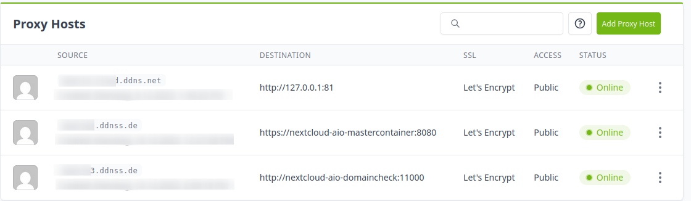
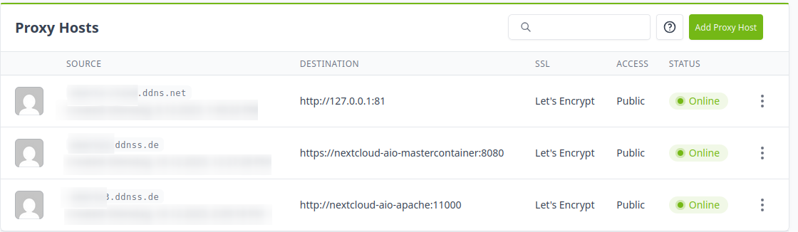
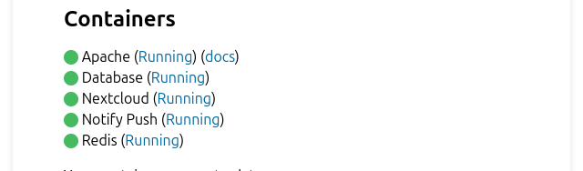

:::::::::::::::::::::::::::::::::::::: questions 

- Gibt es Alternativen zu den Cloud-Plattformen der Tech-Giganten aus Übersee?

- Welche Funktionen und Vorteile bietet Nextcloud?

- Wie installiere ich den Nextcloud-Server auf meinem Server?

::::::::::::::::::::::::::::::::::::::::::::::::

::::::::::::::::::::::::::::::::::::: objectives

- NGINX Proxy Manager für Nextcloud konfigurieren

- Nextcloud All-in-One Dockerimage installieren

::::::::::::::::::::::::::::::::::::::::::::::::

## Nextcloud: Freie Online-Kollaboration und Datensynchronisation

Nextcloud ist eine Open-Source-Software-Suite, die es Nutzern ermöglicht, Dateien, Kalender, Kontakte und weitere Daten auf einem Server zu speichern und zu synchronisieren. Es handelt sich um eine Alternative zu proprietären Cloud-Diensten wie Dropbox oder Google Drive.

**Hauptmerkmale**
- **Dateisynchronisation:** Sichere Speicherung und Synchronisation von Dateien auf mehreren Geräten (Desktop, Mobil, Web).
- **Dateibearbeitung:** (Gemeinsame) Bearbeitung von Dokumenten (Nextcloud Office)
- **Datensicherheit:** Ende-zu-Ende-Verschlüsselung und Self-Hosting/on Premise möglich  sowie viele weitere Sicherheitsfunktionen
- **Multimedia:** Anzeigen, Organisieren und Teilen von Bildern, Musik und Videos.
- **Kommunikation:** Chat und Videotelefonie mit Nextcloud Talk
- **Groupware:** Kalender, Kontakte, Notizen und Aufgaben-Management.

Nextcloud ist unter freien Lizenzen (AGPL- und GPL) veröffentlicht. Dies bedeutet, dass die Software frei genutzt und modifiziert werden kann, solange die Quellcodes frei zugänglich bleiben. Für größere Organisationen gibt eine Enterprise-Version, die erweiterte Funktionen (v.a. Integration von Dritt-Diensten) und Support bietet.

Hinter dem Projekt Nextcloud steht die Nextcloud GmbH, die die Entwicklung steuert und durchführt aber auch Enterprise-Support anbietet. Die Community spielt aber ebenso eine wichtige Rolle bei der Weiterentwicklung von Nextcloud. Aufgrund des freien Lizenzmodells steht es jedem und jeder offen, sich an der Weiterentwicklung zu beteiligen oder eigene Apps zur Funktionserweiterung zu entwickeln.

Benutzer können Nextcloud auf einem eigenen Server installieren und selbst verwalten. Dies bietet maximale Kontrolle über die Daten und erlaubt die Nutzung von Nextcloud ohne Abhängigkeit von einem externen Dienstleister. Alternativ kann bei einem frei zu wählenden Hosting-Provider ein Nextcloud-Server und dessen Verwaltung gemietet werden. Dann liegen die eigenen Daten aber auch auf den Servern dieses Dienstleisters. Im Unterschied zu proprätären Diensten, kann ich mir aber einen Dienstleister meines Vertrauens heraussuchen, ähnlich wie bei der Wahl eines Mail-Providers.

### Nextcloud Server: Installationsvarianten

Nextcloud kann auf verschiedenen Plattformen und in unterschiedlichen Installationsvarianten betrieben werden. Die Wahl der Methode hängt von den spezifischen Anforderungen, der verfügbaren Infrastruktur und den Präferenzen der nutzenden Person ab. Hier ist ein Überblick über die häufigsten Installationsvarianten:

1. **Bare-Metal:** Hierbei wird Nextcloud direkt auf einem physischen Server installiert. Dies bietet maximale Kontrolle und Performance, erfordert jedoch mehr technisches Know-how und ist weniger flexibel als virtuelle Umgebungen. Unterstützt werden Linux und Windows-Betriebssysteme, wobei i.d.R. Linux genutzt wird

4. **Docker:** Docker bietet zwei Möglichkeiten für die Nextcloud-Installation: Das "all-in-one"-Image und die manuelle Installation. Das "all-in-one"-Image ist die als offizielel Installationsvariante empfohlene Option der Nextcloud GmbH. Es ist ein einfach zu installierendes Docker-Image, das gleich mehrere weitere Container für zusätzliche Funktionalität und Optmierung mit bringt. Es erfordert jedoch durch die zusätzlichen Container mehr Ressourcen als die manuelle Installation mit Docker Compose. Bei der manuellen Installation müssen jedoch die einzelnen Komponenten (Nextcloud-Server, Datenbank, Webserver, Caching-Server u.a.) separat konfiguriert werden. Dafür besteht beim manuell erstellten Docker Compose Projekt mehr Flexibilität.

5. **Virtuelle Maschinen (VM):** Nextcloud kann auf einer virtuellen Maschine betrieben werden, was die Isolierung von Ressourcen und die Verwaltung mehrerer Instanzen erleichtert.

6. **Nextcloud Pi:** Nextcloud Pi ist eine spezielle Version von Nextcloud, die für den Einsatz auf Raspberry Pi-Geräten optimiert ist. Sie bietet eine einfache Installation und Verwaltung und ist ideal für kleine Netzwerke oder Heimserver.

In dieser Lektion wird gezeigt, wie das Nextloud All-in-One-Dockerimage installiert werden kann.

### Nextcloud All-in-One

Vor der Installation sollten Sie sich die Informationen im [Github-Repository](https://github.com/nextcloud/all-in-one) durchlesen. Allgemein zur Installation, Konfiguration und Nutzung von Nextcloud ist das [Handbuch][nextlcoud-doc] die erste Anlaufstelle.

Wie bei jedem Docker Compose Projekt wird wieder ein Arbeitsverzeichnis vorbereitet. 

Anschließend muss der NGINX-Proxy-Manager eingerichtet werden (Proxy Host mit TLS-Zertifikat). Genaue Konfigurationshinweise finden sich auch im [Github-Repository](https://github.com/nextcloud/all-in-one/blob/216d238625564ed0051b65cced08a90b66e3d1b5/reverse-proxy.md).

Für die compose.yaml-Datei existiert eine [Vorlage](https://github.com/nextcloud/all-in-one/blob/216d238625564ed0051b65cced08a90b66e3d1b5/compose.yaml). Diese muss jedoch noch stark angepasst werden. In diesem [Thread](https://github.com/nextcloud/all-in-one/discussions/588) auf Github gibt es einige aus der Community berichtete Beispiele (Tip: die Seite nach "NGINX Proxy Manager" durchsuchen).

Hat man eine compose.yaml-Datei erstellt müssen, müssen ggf. lokale Ordner und Dateien für die Docker Volumes erstellt werden. Anschließen kann das Projekt mit `sudo docker compose up` gestartet werden. Hier empfiehlt sich tatsächlich das Starten im Vordergrund, da bei diesem großen Projekt vermutlich zunächst noch Fehler aufkommen, die so direkt gesehen werden.

:::challenge

## Nextcloud All-in-One

Installieren Sie einen Nextlcoud-Server mit Hilfe des Nextcloud All-in-One Images. Nutzen Sie dabei den NGINX Proxy Manager als Reverse Proxy.


::::::solution

Ergänzend zu den oben verlinkten Materialien ist folgendes zu beachten:

1. Es werden **drei** Domains benötigt: 1. für NGINX-Proxy-Manager, zweiters für den Nextcloud Mastercontainer, 3. für Nextcloud selbst.

  1. eine Domain muss weiterleiten an https://nextcloud-aio-mastercontainer:8080

  2. eine Domain muss während der Installation weiterleiten an http://nextcloud-aio-domaincheck:11000 und anschließend an http://nextcloud-aio-apache:11000

{alt='Proxy Hosts für die Installation in NPM'}

{alt='Proxy Hosts nach der Installation in NPM'}

2. NGINX-Proxy-Manager muss in das Docker-Netzwerk nextcloud-aio integriert werden

3. Bei der Installation sollten alle optionalen Container abgewählt werden (der Speicherplatz auf den virtuellen Computern ist limitiert)

{alt='Benötigte Docker Container'}

4. Die Compose-Datei kann wie folgt angepasst und ggf. noch entsprechend den eigenen Bedürfnisse geändert werden:

```yaml
services:
  nextcloud-aio-mastercontainer:
    image: ghcr.io/nextcloud-releases/all-in-one:latest 
    init: true 
    restart: always 
    container_name: nextcloud-aio-mastercontainer 
    volumes:
      - nextcloud_aio_mastercontainer:/mnt/docker-aio-config 
      - /var/run/docker.sock:/var/run/docker.sock:ro 
    networks: ["nextcloud-aio"]
    ports:
      - 8080:8080
    environment: 
      APACHE_PORT: 11000 
      APACHE_IP_BINDING:  127.0.0.1 

volumes:
  nextcloud_aio_mastercontainer:
   name: nextcloud_aio_mastercontainer 

networks:
   nextcloud-aio:
     name: nextcloud-aio
     external: true

```
::::::

:::

::::::::::::::::::::::::::::::::::::: keypoints 

- Die Nextcloud-Software-Suite ist eine Open Source Alternative für Datensychronistaion und Kollaboration im Team

- Nextcloud auf dem eigenen Server installiert werden

- Eine Installationsvariante für einen schnellen Start ist das All-in-One Dockerimage

::::::::::::::::::::::::::::::::::::::::::::::::

