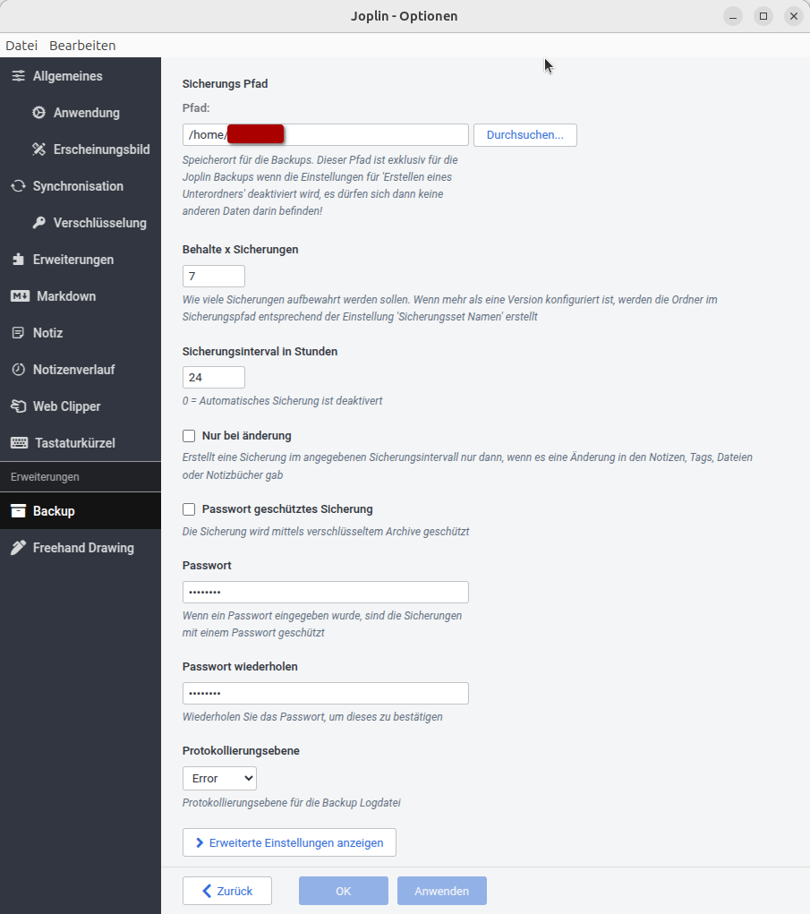

:::::::::::::::::::::::::::::::::::::: questions 

- Was kann ich noch mit Docker tun?

- Wie kann ich meine Notizen besser verwalten?

- Wie installiere ich den Joplin-Server?

::::::::::::::::::::::::::::::::::::::::::::::::

::::::::::::::::::::::::::::::::::::: objectives

- Möglichkeiten und Grenzen des Self- und OnPremise-Hostings

- Einführung in Funktionen und Nutzung von Joplin

- Installation von Joplin mit Docker Compose

::::::::::::::::::::::::::::::::::::::::::::::::

## Möglichkeiten des Self- und OnPremise-Hostings

+ sehr viel, v.a. Open Source Software
  
  + Siehe Awsome Selfhosted Github-Repo (Link)
  
  + v.a. Client-Server-Anwendungen
  
+ Beispiele, jeweils mit Links und kurzer Beschreibung

  + Medienstreaming: Jellyfin
  
  + Filetransfer: gokapi
  
  + Git: gitea
  
  + Smart Home: homeassistant
  
  + Hypervizor/Cloud Computing: proxmox
  
  + Backup: Bacula/Baculum
  
  + Syncthing
  
  + Kalender und Kontakt: Radicale
  
  + Chat und (Video)Telefonie: Matrix, Jitsi, Bigbluebutton

## Grenzen des Self- und OnPremise-Hostings

+ Lizenzrechtliche Einschränkungen: z.B. Nur beim Anbieter, bestimmte Limits wie Useranzahl oder CPU-Ressourcen

+ Hardwareeinschränkungen: je höher die Anforderung, desto mehr Hardware nötig, z.B. für KI-Anwendungen Grafikleistung

+ Bandbreite: Bandbreite im LAN und Bandbreite des Netzanschlusses

+ Serverraum: Energiebedarf, Kühlung, Platzbedarf

+ Know-How: was kann man selbst oder ist bereit zu erlernen, was lagert man besser aus

+ Verfügbarkeit/Verlässlichkeit: kritische Infrastruktur muss immer laufen. Wie gut geschützt vor Ausfällen durch Softwareprobleme, Hardwareausfalls, Stromausfall, Einbruch, Wasserschaden, Blitzschlag

## Möglichkeiten des Self- und OnPremise-Hostings

Self-Hosting im Privatbereich oder On-Premise-Hosting im Enterprisebereich bieten eine breite Palette an Möglichkeiten, insbesondere mit Open-Source-Software. Das [Awesome Selfhosted GitHub-Repository](https://github.com/awesome-selfhosted/awesome-selfhosted) bietet eine umfassende Liste von Beispielen. Das Self- OnPremisehosting ist v.a. dann Interessant, wenn es um Client-Server-Anwendungen geht. Peer-to-Peer-Anwendungen müssen i.d.R. nicht gehostet werden, sondern laufen nur auf den Endgeräten.

Einige Beispiele für selbst betriebene Software:

1. Medienstreaming-Server mit [Jellyfin](https://jellyfin.org/): Eine freie Softwaremedienbibliothek, die es Ihnen ermöglicht, Ihre Filme, Fernsehsendungen und Musik auf verschiedenen Geräten zu organisieren und in Ihrem Netzwerk zu streamen. Als Alternative zu Netflix, Amazon Prime oder dem DVD-Player.

2. Dateiübertragung: [gokapi](https://github.com/Forceu/Gokapi): Eine einfache und sichere Anwendung zur Dateiübertragung, die es Ihnen ermöglicht, Dateien zu teilen, z.B. per E-Mail, ohne auf externe Cloud-Dienste wie z.B. WeTransfer angewiesen zu sein.

3. Versionskontrolle nach Git-Standard mit [gitea](https://gitea.io/en-us/): Eine selbst gehostete Git-Plattform, die es Ihnen ermöglicht, Ihre eigenen Git-Repositories zu hosten und zu verwalten. Als Alternative zu github oder gitlab.

4. Smart Home: [homeassistant](https://www.home-assistant.io/): Eine Open-Source-Plattform, die es Ihnen ermöglicht, Ihre Smart-Home-Geräte zu integrieren und zu automatisieren, um Ihr Zuhause sicherer, bequemer und energieeffizienter zu machen.

5. Mit [proxmox](https://www.proxmox.com/en/) den eigenen Hypervisor für das eigene Cloud Computing betreiben: Eine Open-Source-Software, die es Ihnen ermöglicht, Ihren eigenen Hypervisor zu betreiben und virtuelle Maschinen und Container zu hosten, um Ihre Infrastruktur zu vereinfachen und zu skalieren.

6. Zentralisierte Backupverwaltung mit [Bacula](https://www.bacula.org/) oder [Baculum](https://baculum.app/): Open-Source-Softwarelösungen für die Datensicherung, die es Ihnen ermöglichen, Ihre Daten zu sichern und wiederherzustellen, ohne auf Cloud-basierte Datensicherungsdienste angewiesen zu sein.

7. Dateisynchronisation mit [Syncthing](https://syncthing.net/): Eine Open-Source-Software für die kontinuierliche Dateisynchronisation, die es Ihnen ermöglicht, Ihre Dateien zwischen Ihren (Mobil)Geräten zu synchronisieren. Alternative zu den Cloud-Lösungen der Smartphone-Hersteller (Google, Apple, Samsung etc)

8. Kalender und Kontakte: [Radicale](https://radicale.org/): Eine Open-Source-Software für die Verwaltung von Kalendern und Kontakten, die es Ihnen ermöglicht, Ihre Kalender und Kontakte selbst zu hosten und zu verwalten. Alternative zu Google Contacts.

9. Chat und (Video)Telefonie mit [Matrix](https://matrix.org/), [Jitsi](https://jitsi.org/) oder [Bigbluebutton](https://bigbluebutton.org/): Open-Source-Softwarelösungen für Chat und (Video)Telefonie, die es Ihnen ermöglichen, sicher und privat mit Ihren Freunden und Kollegen zu kommunizieren. Matrix bietet dabei Ende-zu-Ende-Verschlüsselung und zahlreiche Funktionen zur Integration in Unternehmen. Jitsi zielt eher auf den Privatbereichh oder kleinere Firmen. Bigbluebutton ist eine Videokonferenzlösung für den Bildungsbereich (Schule, Hochschulen, Kurse).

## Grenzen des Self- und OnPremise-Hostings

Allerdings hat Self-Hosting bzw. On-Premise-Hosting auch Grenzen:

1. Rechtliche Einschränkungen: Einige Software kann nur vom Anbieter verwendet werden oder unterliegt bestimmten Einschränkungen wie der Benutzeranzahl oder der maximal verwendbaren CPU-Kerne. 
2. Hardware-Einschränkungen: Je anspruchsvoller die Anwendung, desto mehr Hardware ist erforderlich. KI-Anwendungen erfordern beispielsweise erhebliche Grafikleistung.
3. Bandbreite: Die Bandbreite im lokalen Netzwerk und die Bandbreite der Internetverbindung können limitierende Faktoren sein.
4. Serverraum: Der Energieverbrauch, die Anforderungen an die Kühlung und der Platzbedarf können signifikant sein.
5. Expertise: Bei der Entscheidung, was selbst gehostet werden soll oder was ausgelagert werden soll, muss auch das eigene Wissen bzw. die Bereitschaft zum Erwerb des Wissens in Betracht gezogen werden.
6. Verfügbarkeit/Zuverlässigkeit: Kritische Infrastruktur muss stets verfügbar sein. Deshalb sollten auch Szenarien wie Ausfälle durch Anwenderfehler, Softwareprobleme, Hardwareausfälle, Stromausfälle, Einbruch, Wasserschaden oder Blitzschlag beachtet werden. Ist der Schutz davor lokal nicht möglich aber die Verfügbarkeit der Dienste nötig, sollte die Auslagerung an einen Dienstleister in Betracht gezogen werden.

## Joplin: Knowledge-Management mit dem eigenen Server

Joplin ist eine Open-Source-Software für Notizen und Aufgabenverwaltung, die sowohl für Einzelpersonen als auch für Teams geeignet ist. Mit Joplin können Sie Ihre Notizen und ToDo-Listen sicher und privat auf Ihrem eigenen Server hosten, ohne auf Cloud-basierte Dienste angewiesen zu sein. Die Software unterstützt Markdown, bietet eine Vielzahl von Plugins und kann über verschiedene Plattformen synchronisiert werden.

### Weitere Informationen:

- [Joplin Dokumentation](https://joplinapp.org/help/)
- [Joplin GitHub](https://github.com/laurent22/joplin)
- [Joplin Homepage](https://joplinapp.org/)

### Alternative: Notesnook

Eine alternative Lösung für Self-Hosting von Notizen ist [Notesnook](https://notesnook.com/). Notesnook bietet ebenfalls eine sichere und private Möglichkeit, Ihre Notizen zu verwalten. Derzeit befindet sich das [Self-Hosting via Docker](https://github.com/streetwriters/notesnook-sync-server) noch in der Beta-Phase, aber es ist eine vielversprechende Option für diejenigen, die eine Alternative zu Joplin suchen.

### Lizenz
Die Joplin-Clientanwendungen werden unter einer Open Source Lizenz veröffentlicht (AGPL-3). Der Source-Code ist [frei einsehbar](https://github.com/laurent22/joplin). Die Clientanwendungen können die erstellten Notizen entweder bei Kauf eines [Abonnements](https://joplinapp.org/plans/) beim Anbieter über dessen Server, über einen selbst betriebenen Joplin-Server oder über andere Dienste wie Nextcloud oder Dropbox synchronisiert werden. Siehe dazu die Kapitel im [Handbuch](https://joplinapp.org/help/apps/sync/). Die Synchronisation mit einem Joplin Server (Joplin Cloud oder Self Hosted) bietet dabei mehr Perfomance und Funktionalität (z.B. Teilen von Notizen).

:::callout

# Softwarekomponenten

+ Joplin-Server: optional, Server für Synchronistation. Entweder beim Anbieter mieten oder selbst hosten.

  + Alternative Synchronsationsserver: Nextcloud, Dropbox, OneDrive u.a.
  
+ Joplin-Clients: Client-Awendung zum verfassen von Notizen. Verfügbar für PC, Mac und Mobilgeräte

:::

### Funktionen

+ Notizen und ToDo-Listen verfassen
  
  + im Markdown-Format
  
  + in einer "normalen" Ansicht ([WYSIWYG-Editor](https://de.wikipedia.org/wiki/WYSIWYG))

+ Unterstützt u.a.

  + ToDo-Listen
  + Tabellen
  + Abbildungen
  + Handzeichnungen

+ Automatisierte Backups

+ zahlreiche [Erweiterungen](https://joplinapp.org/plugins/)
+ [Kollaboratives Arbeiten](https://joplinapp.org/help/apps/teams)
+ Organisation durch Schlagworte und Sammlungen ("Notizbücher")

### Installation

Im Github-Repository findet sich ein Beispiel für eine [compose.yaml-Datei](https://github.com/laurent22/joplin/blob/8d1d1be79eaea4dfdfadd0b23f28a48760840eae/docker-compose.server.yml). Diese beinhaltet auch einen Service für den [Transcribe-Dienst](https://joplinapp.org/help/apps/transcribe/system_architecture) zur Übersetzung von handschriftlichen Notizen in digitale Texte. Dieser Dienst benötigt sehr viel Ressourcen, weshalb dieser Container (und damit das Transcribe-Feature) im Selfhostingbereich evtl. weg gelassen werden sollte.

Eine auch für kleinere Umgebungen geeignete compose.yaml-Datei kann wie folgt aussehen

```YAML
services
  joplin

```
Ergänzt wird die Compose Datei durch eine `.env`-Datei für die Umgebungsvariablen. Auch dafür gibt es eine [Vorlage](https://github.com/laurent22/joplin/blob/8d1d1be79eaea4dfdfadd0b23f28a48760840eae/.env-sample) die wie folgt vereinfacht werden kann:

```
APP_BASE_URL=https://example.com/joplin
APP_PORT=22300
 
DB_CLIENT=pg
POSTGRES_PASSWORD=joplin
POSTGRES_DATABASE=joplin
POSTGRES_USER=joplin
POSTGRES_PORT=5432
POSTGRES_HOST=joplin-db

```
Wichtig sind dabei die APP_BASE_URL und die POSTGRES_ Parameter. Statt einer Datenbank kann auch das Dateisystem als Speicher genutzt werden (siehe [hier](https://hub.docker.com/r/joplin/server)). Grundlegend wird aber eine Datenbank als Speicher empfohlen.

Damit der Joplinserver erreicht werden kann, muss eine Domain vorhanden sein und im NGINX-Proxy-Manager hinterlegt sein.

Die Konfiguration des Proxy-Hosts sieht wie folgt aus:

<!-- Abbildungen aus NPM ergänzen -->

Die Clientanwendung für die Endgeräte kann auf der [Homepage von Joplin](https://joplinapp.org/) heruntergeladen und installiert werden.

### Konfiguration

+ Nach der Installation der Clientanwendgung muss in den Einstellungen die Verbindung zum eigenen Joplinserver eingetragen werden. Dazu im Menü unter Werkzeuge den Punkt Optionen öffnen und als Synchronisationsziel `Jopin Server (Beta)` auswählen. Anschließend kann die URL zum eigenen Server, der Nutzername und das Passwort eingetragen werden. Anschließend kann die Verbindung getestet werden.

{alt='Konfigurationsmenü von Joplin. Zu sehen sind die Einstellungen für die Synchronistaion'}

+ Um Datenverlust zu vermeiden empfiehlt es sich, die Notizen am Endgerät zu sichern. Dazu kann unter dem Punkt ein Zielverzeichnis gewählt werden und die genaue Ausführung eingerichtet werden. Werden die Notizen auf einem unverschlüsseltem Medium gepspeichert, empfiehtl sich das Setzen eines Passwortes, um zu verhindern, dass die Notizen von Dritten eingesehen werden können.

{alt='Backupkonfiguration unter Joplin. Zielverzeichnis ist ein lokaler Pfad.'}

+ Wurden weitere Plugins installiert (z.B. der Web Clipper, oder das KI-Tool [Jarvis](https://joplinapp.org/plugins/plugin/joplin.plugin.alondmnt.jarvis/)) können diese ebenfalls in den Optionen eingerichet werden

::::::::::::::::::::::::::::::::::::: keypoints 

- Ist Docker einmal installiert und ein Reverse Proxy eingerichtet, können schnell weitere Dienste gehostet werden

- Mit Joplin können die eigenen Notizen (und ggf. die des Teams) auf dem eigenen Server gespeichert werden

- Joplin kann mit dem Joplin Server oder anderen Dateidiensten betrieben werden

- Der Joplin Server kann mit Docker Compose installiert werden

::::::::::::::::::::::::::::::::::::::::::::::::

