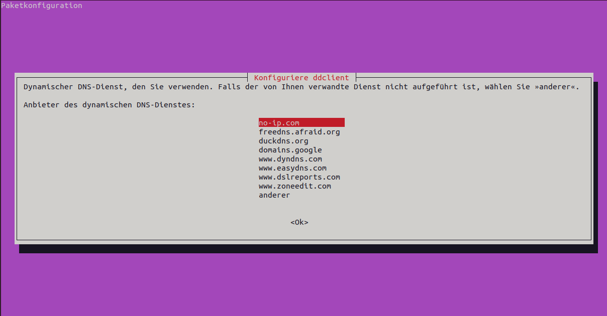
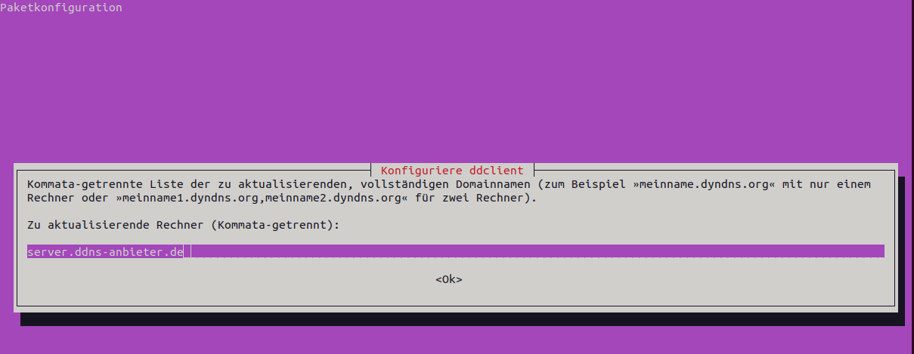

:::::::::::::::::::::::::::::::::::::: questions 

- Wie können Webapplikation im Internet erreichbar gemacht werden?

- Wie funktionieren Webserver?

- Wie sichere ich die Kommunikation ab?

- Wie kann ein Webserver in Docker Compose erstellt werden

::::::::::::::::::::::::::::::::::::::::::::::::

::::::::::::::::::::::::::::::::::::: objectives

- Grundlagen von Webservern
- Domainnamen mit DDNS erhalten
- TLS-Zertifikate mit Letsencrypt erhalten
- Webserver mit Docker compose erstellen

::::::::::::::::::::::::::::::::::::::::::::::::

## Allgemeines zu Webservern

Webserver sind Softwarekomponenten, die auf Anfragen von Clients (z.B. Browsern) reagieren und diese Anfragen an eine Webapplikation (oder weitere Webserver) weiterleiten. Damit spielen sie eine wichtige Rolle in der Bereitstellung von Webapplikationen.

Abhängig von der angefragten Domain (`uni-tuebingen.de`) oder der konkreten Datei (`uni-tuebingen.de/index.html`) wird der Webserver Dateien zurück liefern, an eine Webapplikation weiterleiten oder Funktionen ausführen. Dies ermöglicht es auch, mehrere Webapplikationen auf einem einzigen Server zu hosten und den Datenverkehr effizient zu verwalten.

Durch die Überwachung der Verbindung zwischen Client und Webapplikation kann sichergestellt werden, dass die Verbindung stabil und zuverlässig ist. Für Verbindungen über das Internet oder andere unsichere Netzwerke sollte immer eine verschlüsselte Kommunikation aufgebaut werden. Diese wird ebenfalls im Webserver konfiguriert (z.B. mit TLS-Zertifikaten für die HTTPS-Verbindung).

Webserver können auch die Authentifizierung von Benutzern ermöglichen oder Anfragen auf Basis bestimmter Kriterien (z.B. Herkunft der IP-Adresse oder Anfragehäufigkeit) blockieren. Dadurch kann unerwünschter Traffic blockiert werden, die Leistung der Webapplikation verbessert werden und die Sicherheit erhöht.

Eine weitere Funktionalität ist das Load-Balancing. Hierbei kann ein Webserver große Mengen an angefragten Daten auf mehrere sogenannten Upstream-Server verteilen, um die Last je Server in Grenzen zu halten.

Da der Webserver der zentrale Kommunikationsknoten zwischen Webapplikation und Client ist, ist dessen Konfiguration für die Sicherheit und Stabilität der Webapplikation (bzw. der Kommunikation mit dieser) äußerst wichtig. Die genaue Konfiguration eines Webservers ist jeweils abhängig vom genauen Einsatzzweck. Für viele Webapplikationen stellen die Hersteller Vorlagen für Konfigurationen der Webserver bereit. 

Einige wichtige Webserver sind:

- Nginx (offene Lizenz, modern, eher leichtgewichtig, weit verbreitet)
- Apache2 (offene Lizenz, der "Dinosaurier" unter den Webserver, performant, weit verbreitet)
- Microsoft IIS (proprietär)
- Google Web Server (proprietär, nur von Google-Diensten verwendet)

## Externer Zugriff

Um einen Webserver aus dem Internet erreichen zu können, muss der Server, auf welchem die Webserver-Software installiert ist, und das Netzwerk in welchem er sich befindet eine öffentliche IP-Adresse und idealerweise auch einen öffentlich bekannten Domainnamen haben.

Für diesen Kurs ist der Hypervisor, auf welchem die virtuellen Server laufen, über eine IP-Adresse im Internet erreichbar. Ein zentraler Webserver ist als Proxy-Server konfiguriert und leitet Anfragen abhängig von der angefragten Domain intern an die jeweilige virtuelle Maschine weiter. Dort muss dann ein eigener Webserver die Anfrage annehmen und verarbeiten.

Allerdings müssen Sie eine Domain für Ihren Server konfigurieren. Hierzu kann kostenpflichtig eine vollwertige Domain erworben werden (`domain.de`) oder man nutzt kostenlose DDNS-Dienste (DDNS=Dynamic Domain Name System). 

DDNS funktioniert unter Zuhilfenahme eines externen Dienstleisters. Bei diesem wird eine Subdomain beantragt, z.B. *server.dns-anbieter.de*. Auf dem eigenen Server kann das Programm **DDClient** installiert werden. Dieses kontaktiert regelmäßig eine Internetseite und erhält von dieser die eigene öffentliche IP-Adresse als Echo zurück. Dadurch erfährt DDClient, unter welcher IP-Adresse der Server erreichbar ist und schickt diese an den DDNS-Anbieter, bei welchem die eigene Domain beantragt wurde. Dieser Anbieter wiederum trägt die IP-Adresse in seinem DNS ein.

:::callout
### DNS
**DNS** kann als Telefonbuch des Internets verstanden werden, in welchem IP-Adressen in Domainnamen übersetzt werden, z.B. wird die IP-Adresse 49.13.55.174. in [wikipedia.de](https://wikipedia.de) übersetzt. Mehr zum Thema DNS findet sich z.B. beim [Elektronikkompendium](https://www.elektronik-kompendium.de/sites/net/0901141.htm).
:::

Ruft ein Computer die Adresse *server.dns-anbieter.de* auf, wird im DNS des DDNS-Anbieters die öffentliche IP-Adresse des Servers (in unserem Fall die Adresse des zentralen Proxy-Servers) ausgelesen und übermittelt. Dadurch wird die Anfrage an die richtige IP-Adresse geschickt.

Es gibt verschiedene Anbieter für DDNS-Dienste. Gut geeignet sind z.B. [No-IP](https://noip.com) oder [DDNSS](https://www.ddnss.de/).

DDNS wird eigentlich primär verwendet, um an privaten Internetanschlüssen, die häufig die IP-Adresse ändern, dennoch immer über die gleiche Domain erreichbar zu sein. Im Fall des Kurses ist eine statische öffentliche IP-Adresse vorhanden und  es wäre sauberer eine ordentliche Domain zu kaufen (oder im Rechenzentrum der Universität zu beantragen). Für die Testzwecke dieses Kurses genügt aber auch eine DDNS-Domain. Zeitgleich kann die damit erlernte Technik auch gut für Zwecke des Selfhosting im heimischen Wohnzimmer angewendet werden.

### Umsetzung DDNS unter Ubuntu

Für die Implementierung des DDNS-Verfahrens wird wie folgt vorgegangen:

- Account bei einem DDNS-Anbieter registrieren

- Im Falle von *No-IP* muss im [Webportal](https://noip.com) des Anbieters ein Benutzername festgelegt werden

- Beim gewählten Anbieter muss ein Domainname reserviert werden (A-Record für IPv4 oder AAAA-Record für IPv6)

- ddclient auf dem Server installieren und konfigurieren: `sudo apt-get install ddclient`

    - Im Anschließenden Dialog wird im Falle von No-IP *no-ip* gewählt, ansonsten *anderer*
    
    - als Benutzername und Passwort werden die Zugangsdaten des DDNS-Anbieters eingetragen
    
    - als *IP-Adressen-Ermittlungsmethode* wird *Web-basierter IP-Ermittlungsdienst* gewählt
    
    - der zu aktualisierende Rechner ist der beim DDNS-Anbieter reservierte Domainnamen
    
{alt='Konfigurationsdialog von DDClient. Es stehen mehrere DDNS-Anbieter zur Auswahl. Hervorgehoben ist no-ip.com'}    

{alt='Konfigurationsdialog von DDClient: festlegen der IP-Ermittlungsmethode, hervorgehoben ist die Option web-basierter IP-Ermittlungsdienst'}

{alt='Konfigurationsdialog von DDClient: eingabe des Domainnamens, als Platzhalter ist server.ddns-anbieter.de zu sehen'}    

Nach der Installation sollte die **Konfigurationsdatei** überprüft und ggf. angepasst werden: `sudo nano /etc/ddclient.conf`. Je nach DDNS-Anbieter sieht die Konfigurationsdatei unterschiedlich aus.

:::tab
### DDNSS.de

```bash
#für ddnss.de
protocol=dyndns2
use=web, web=https://api.ipify.org/ 
server=ddnss.de
login=<DDNSSLoginName>
password='<Passwort>'
<domainname>.ddnss.de
```

### NO-IP:

```bash
#NO-IP.com
protocol=noip
use=web, web=http://ip1.dynupdate.no-ip.com/
login=<noip-username>
password=’<noip-passwort>’
<noip-Domainname>
```
:::
::::::::::::::::::::::::::::::::::::: keypoints 

- 
::::::::::::::::::::::::::::::::::::::::::::::::

