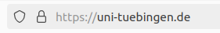

:::::::::::::::::::::::::::::::::::::: questions 

- Wie können Webapplikation im Internet erreichbar gemacht werden?

- Wie funktionieren Webserver?

- Wie sichere ich die Kommunikation ab?

- Wie kann ein Webserver in Docker Compose erstellt werden

::::::::::::::::::::::::::::::::::::::::::::::::

::::::::::::::::::::::::::::::::::::: objectives

- Grundlagen von Webservern
- Domainnamen mit DDNS erhalten
- TLS-Zertifikate mit Letsencrypt erhalten
- Webserver mit Docker compose erstellen

::::::::::::::::::::::::::::::::::::::::::::::::

## Allgemeines zu Webservern

Webserver sind Softwarekomponenten, die auf Anfragen von Clients (z.B. Browsern) reagieren und diese Anfragen an eine Webapplikation (oder weitere Webserver) weiterleiten. Damit spielen sie eine wichtige Rolle in der Bereitstellung von Webapplikationen.

Abhängig von der angefragten Domain (`uni-tuebingen.de`) oder der konkreten Datei (`uni-tuebingen.de/index.html`) wird der Webserver Dateien zurück liefern, an eine Webapplikation weiterleiten oder Funktionen ausführen. Dies ermöglicht es auch, mehrere Webapplikationen auf einem einzigen Server zu hosten und den Datenverkehr effizient zu verwalten.

Durch die Überwachung der Verbindung zwischen Client und Webapplikation kann sichergestellt werden, dass die Verbindung stabil und zuverlässig ist. Für Verbindungen über das Internet oder andere unsichere Netzwerke sollte immer eine verschlüsselte Kommunikation aufgebaut werden. Diese wird ebenfalls im Webserver konfiguriert (z.B. mit TLS-Zertifikaten für die HTTPS-Verbindung).

Webserver können auch die Authentifizierung von Benutzern ermöglichen oder Anfragen auf Basis bestimmter Kriterien (z.B. Herkunft der IP-Adresse oder Anfragehäufigkeit) blockieren. Dadurch kann unerwünschter Traffic blockiert werden, die Leistung der Webapplikation verbessert werden und die Sicherheit erhöht.

Eine weitere Funktionalität ist das Load-Balancing. Hierbei kann ein Webserver große Mengen an angefragten Daten auf mehrere sogenannten Upstream-Server verteilen, um die Last je Server in Grenzen zu halten.

Da der Webserver der zentrale Kommunikationsknoten zwischen Webapplikation und Client ist, ist dessen Konfiguration für die Sicherheit und Stabilität der Webapplikation (bzw. der Kommunikation mit dieser) äußerst wichtig. Die genaue Konfiguration eines Webservers ist jeweils abhängig vom genauen Einsatzzweck. Für viele Webapplikationen stellen die Hersteller Vorlagen für Konfigurationen der Webserver bereit. 

Einige wichtige Webserver sind:

- Nginx (offene Lizenz, modern, eher leichtgewichtig, weit verbreitet)
- Apache2 (offene Lizenz, der "Dinosaurier" unter den Webserver, performant, weit verbreitet)
- Microsoft IIS (proprietär)
- Google Web Server (proprietär, nur von Google-Diensten verwendet)

## Externer Zugriff

Um einen Webserver aus dem Internet erreichen zu können, muss der Server, auf welchem die Webserver-Software installiert ist, und das Netzwerk in welchem sich der Server befindet eine öffentliche IP-Adresse und idealerweise auch einen öffentlich bekannten Domainnamen haben.

Für diesen Kurs ist der Hypervisor, auf welchem die virtuellen Server laufen, über eine IP-Adresse im Internet erreichbar. Ein zentraler Webserver ist als Proxy-Server konfiguriert und leitet Anfragen abhängig von der angefragten Domain intern an die jeweilige virtuelle Maschine weiter. Dort muss dann ein eigener Webserver die Anfrage annehmen und verarbeiten.

Allerdings müssen Sie eine Domain für Ihren Server konfigurieren. Hierzu kann kostenpflichtig eine vollwertige Domain erworben werden (`domain.de`) oder man nutzt kostenlose DDNS-Dienste (DDNS=Dynamic Domain Name System). 

DDNS funktioniert unter Zuhilfenahme eines externen Dienstleisters. Bei diesem wird eine Subdomain beantragt, z.B. *server.ddns-anbieter.de*. Auf dem eigenen Server kann das Programm **DDClient** installiert werden. Dieses kontaktiert regelmäßig eine Internetseite und erhält von dieser die eigene öffentliche IP-Adresse als Echo zurück. Dadurch erfährt DDClient, unter welcher IP-Adresse der Server erreichbar ist und schickt diese an den DDNS-Anbieter, bei welchem die eigene Domain beantragt wurde. Dieser Anbieter wiederum trägt die IP-Adresse in seinem DNS ein und macht dadurch die IP-Adresse zur Domain öffentlich bekannt.

:::callout
### DNS
**DNS** kann als Telefonbuch des Internets verstanden werden, in welchem IP-Adressen in Domainnamen übersetzt werden, z.B. wird die IP-Adresse 49.13.55.174. in [wikipedia.de](https://wikipedia.de) übersetzt. Mehr zum Thema DNS findet sich z.B. beim [Elektronikkompendium](https://www.elektronik-kompendium.de/sites/net/0901141.htm).
:::

Ruft ein Computer die Adresse *server.ddns-anbieter.de* auf, wird im DNS des DDNS-Anbieters die öffentliche IP-Adresse des Servers (in unserem Fall die Adresse des zentralen Proxy-Servers) ausgelesen und übermittelt. Dadurch wird die Anfrage an die richtige IP-Adresse geschickt.

Es gibt verschiedene Anbieter für DDNS-Dienste. Gut geeignet sind z.B. [No-IP](https://noip.com) oder [DDNSS](https://www.ddnss.de/).

DDNS wird eigentlich primär verwendet, um an privaten Internetanschlüssen, die häufig eine sich änderende IP-Adresse haben, immer über die gleiche Domain erreichbar zu sein. Im Fall des Kurses ist eine statische öffentliche IP-Adresse vorhanden und  es wäre sauberer eine ordentliche Domain zu kaufen (oder im Rechenzentrum der Universität zu beantragen). Für die Testzwecke dieses Kurses genügt aber eine DDNS-Domain. Zeitgleich kann die damit erlernte Technik auch gut für Zwecke des Selfhostings im heimischen Wohnzimmer oder kleinen Büros ohne statische IP-Adresse angewendet werden.

### Umsetzung DDNS unter Ubuntu

Für die Implementierung des DDNS-Verfahrens wird wie folgt vorgegangen:

- Account bei einem DDNS-Anbieter registrieren

- Im Falle von *No-IP* muss im [Webportal](https://noip.com) des Anbieters nach der Registrierung noch ein Benutzername festgelegt werden

- Beim gewählten Anbieter muss ein Domainname reserviert werden (A-Record für IPv4 oder AAAA-Record für IPv6)

- ddclient auf dem Server installieren und konfigurieren: `sudo apt-get install ddclient`

    - Im Anschließenden Dialog wird im Falle von No-IP *no-ip* gewählt, ansonsten *anderer*
    
    - als Benutzername und Passwort werden die Zugangsdaten des DDNS-Anbieters eingetragen
    
    - als *IP-Adressen-Ermittlungsmethode* wird *Web-basierter IP-Ermittlungsdienst* gewählt
    
    - der zu aktualisierende Rechner ist der beim DDNS-Anbieter reservierte Domainnamen
    
{alt='Konfigurationsdialog von DDClient. Es stehen mehrere DDNS-Anbieter zur Auswahl. Hervorgehoben ist no-ip.com'}    

{alt='Konfigurationsdialog von DDClient: festlegen der IP-Ermittlungsmethode, hervorgehoben ist die Option web-basierter IP-Ermittlungsdienst'}

{alt='Konfigurationsdialog von DDClient: eingabe des Domainnamens, als Platzhalter ist server.ddns-anbieter.de zu sehen'}    

Nach der Installation sollte die **Konfigurationsdatei** überprüft und ggf. angepasst werden: `sudo nano /etc/ddclient.conf`. Je nach DDNS-Anbieter sieht die Konfigurationsdatei unterschiedlich aus.

:::tab
### DDNSS.de

```bash
#für ddnss.de
protocol=dyndns2
use=web, web=https://api.ipify.org/ 
server=ddnss.de
login=<DDNSSLoginName>
password='<Passwort>'
<domainname>.ddnss.de
```

### NO-IP:

```bash
#NO-IP.com
protocol=noip
use=web, web=http://ip1.dynupdate.no-ip.com/
login=<noip-username>
password=’<noip-passwort>’
<noip-Domainname>
```
:::

Wird die Konfigurationsdatei manuell geändert, muss ddclient neu gestartet werden: `sudo systemctl restart ddclient.service`

## Webserver mit Docker

Damit auf dem eigenen Server auf Anfragen aus dem Internet auch reagiert wird, muss ein Webserver installiert werden. Dazu kann in einem Docker Compose Projekt der Apache-Webserver installiert werden. Um die Grundfunktionalität zu testen, wird vorerst keine besondere Konfiguration vorgenommen.

### Docker Compose Projekt erstellen

1. Arbeitsverzeichnis anlegen: z.B. `sudo mkdir /opt/apache-docker/` und `sudo chown <username>:<username> /opt/apache-docker`

2. Ins Arbeitsverzeichnis wechseln (`cd`- Befehl)

3. Dort die Compose-Datei erstellen (`nano compose.yaml`)

  ```yaml
  services:
  apache:
    image: httpd:latest
    container_name: apache
    ports:
    - '80:80'
    volumes:
    - ./website:/usr/local/apache2/htdocs
  ```
4. Volume-Verzeichnis für den Datenaustausch mit dem Container erstellen: `mkdir website`

5. Website-Beispiel erstellen: `nano website/index.html`, z.B. wie folgt

  ```html
  <!DOCTYPE html>
  <html>
  <head>
      <title>Apache-Test</title>
      <style>
          body {
              font-family: Arial, sans-serif;
          }
          h1 {
              color: blue;
          }
          p {
              font-size: 18px;
          }
      </style>
  </head>
  <body>
      <h1>Welcome to Apache-Test</h1>
      <p>This is a simple paragraph to test the Apache server.</p>
  </body>
  </html>
  ```
6. Docker Container starten: `sudo docker compose up` oder im Hintergrund `sudo docker compose up -d`

7. Erreichbarkeit testen: öffnen Sie auf einem Endgerät im Webbrowser ihre registrierte DDNS-Domain. Wird Ihnen die Beispiel-HTML-Datei angezeigt?

8. Container stoppen: `STRG`+ `c` oder im Hintergrund `sudo docker compose down`

### TLS-Verschlüsselung

#### Kommunikationsweg:

Aktuell erfolgt die Kommunikation mit dem Server über das HTTP-Protokoll mit Port 80. Diese Verbindung ist unverschlüsselt. Das bedeutet, dass sämtliche Daten (z.B. Passwörter und Dateien) die zum Server geschickt oder vom Server verschickt werden, von einem "Zuhörer" auf der Leitung mitgelesen werden können (das geht z.B. mit dem Tool [Wireshark](https://www.wireshark.org/about.html) v.a. im LAN recht einfach, siehe z.B. diese Anleitung von [Varonis](https://www.varonis.com/de/blog/verwendung-von-wireshark)).

#### Grundlagen der HTTPS-Verbindung

Um das Auslesen der Verbindung und damit das Abfangen sämtlicher Kommunikation zu unterbinden, muss die Verbindung verschlüsselt werden. Um eine HTTP-Verbindung zu verschlüsseln wird diese durch das TLS-Protokoll zu einer HTTP**S**-Verbindung erweitert. HTTPS ist heute glücklicherweise der Standard bei den meisten Internetseiten. Dass Sie eine HTTPS-Verbindung zu einer Seite aufgebaut haben, erkennen Sie in der Adresszeile Ihres Browsers anhand eines Schlosssymbols, bei besonders starken Zertifikaten ggf. zusätzlich auch anhand einer grünen Markierung (siehe die folgende Abbildung).

{alt='Browseradresszeile mit der Adresse https://uni-tuebingen.de. Durch ein Schlosssymbol wird die https-Verbindung dargestellt.'}

Die Grundlage des TLS-Protokolls stellen Zertifikate dar, die die Authentizität der Website bestätigen. 

Dazu ein nicht technisches Vergleichsbeispiel: Sie wollen bei einem Geschäftsvorgang die Identität des Gegenübers überprüfen. Zeigt Ihnen die Person einen selbst ausgestellten Ausweis, werden Sie diesem Personalausweis nicht vertrauen. Zeigt die Person jedoch einen Ausweis, der von einer staatlichen Behörde ausgestellt wurde, welcher Sie vertrauen, können Sie auch dem vorgelegten Ausweis vertrauen.

Übertragen auf die HTTPS-Verbindung sieht es wie folgt aus: Ein Website-Betreiber kann sich selbst ein TLS-Zertifikat ausstellen (unter Linux z.B. mit dem Programm *OpenSSL*) und dieses einem anfragendem Webbrowser oder sonstigem Client präsentieren. Allerdings kann einem solchen selbst ausgestellten Zertifikat nicht von Dritten vertraut werden. Der Browser wird die Verbindung als unsicher ablehnen und eine Warnmeldung zeigen. Damit ein Client dem Zertifikat vertrauen kann, muss dieses genau wie beim Personalausweis von einer zentralen Stelle ausgestellt werden. Diese zentralen Stellen (als *Zertifizierungsstellen* oder im Englischen als *Certificate Authority* bezeichnet) können auf Anfrage ein Zertifikat ausstellen, sofern die Identität der anfragenden Stelle gewährleistet ist. 

Gleichzeitig besitzt die Zertifizierungsstelle selbst ein Zertifikat, dass deren Identität bestätigt. Dieses Zertifizierungsstellenzertifikat wiederum ist vom Hersteller Ihres Betriebssystems auf Ihrem PC hinterlegt und als vertrauenswürdig eingestuft worden. Überprüft Ihr Browser nun das Zertifikat der Website, stellt er zunächst fest, dass das präsentierte Zertifikat von einer Zertifizierungsstelle ausgestellt wurde, welcher er vertraut. Außerdem wird überprüft, ob die aufgerufene Adresse auch der im Zertifikat hinterlegten Adresse entspricht.

Rufen Sie eine Website auf, die ein falsches Zertifikat präsentiert (z.B. für die falsche Adresse, ein abgelaufenes oder selbst ausgestelltes Zertifikat), erhalten Sie eine Warnmeldung. Diese sollten Sie ernst nehmen, da es auf einen Betrugsversuch hindeuten kann, in welchem eine angreifende Person sich für die Website ausgibt, die Sie eigentlich aufrufen wollten (z.B. die Seite Ihres Online-Bankings).

{alt='Browserfenster, dass eine unsichere https-Verbindung zeigt, welche mit einer Warnung angezeigt wird: "Warnung: Mögliches Sicherheitsrisiko erkannt"'}

#### TLS-Verschlüsselung einrichten

Um die eigene Website per HTTPS erreichen zu können, muss der Server ein Zertifikat von einer Zertifizierungsstelle erhalten, die von allen Computern anerkannt ist. Während dies früher nur gegen Bezahlung möglich war, existiert seit einigen Jahren mit [Letsencrypt](https://letsencrypt.org/) ein gemeinnütziger Anbieter, der kostenlose Zertifikate zur Verfügung stellt. Diese sind jedoch nur **drei Monate gültig** und müssen dann **verlängert** werden.

Um ein solches Zertifikat zu erhalten, muss man gegenüber Letsencrypt nachweisen, dass man die Eigentümer der Domain ist, für welche das Zertifikat angefragt wird. Das heißt: wenn Sie für die Adresse *server.ddns-provider.de* ein Zertifikat erhalten wollen, müssen Sie nachweisen, dass sie den Webserver, der die Seite *server.ddns-provider.de* ausliefert, verwalten. Diesen Nachweis erbringen Sie nicht manuell, sondern mit Hilfe verschiedener Programme (z.B. Certbot). Mit diesen Programmen werden automatisiert einige Informationen zwischen Ihrem Webserver und den Servern von Letsencrypt ausgetauscht, anhand deren die Eigentümerschaft nachgewiesen werden kann. Anschließend wird das Zertifikat von der Zertifizierungsstelle (Letsencrypt) ausgestellt und kann dann in den eigenen Webserver integriert werden.

#### Zertifikat erhalten:
In Docker kann das Hilfsprogramm für den Erhalt des Zertifikats in das Docker Compose Projekt integriert werden. Hierzu bestehen, wie eine Internetrecherche schnell aufzeigen wird, verschiedene Möglichkeiten.

Im Folgenden eine Möglichkeit, in welcher das Program certbot als zweiter Container dem Docker Compose Projekt hinzugefügt wird:

```YAML
services:
  apache:
    image: httpd:latest
    container_name: apache
    ports:
    - '80:80'
    - '443:443'
    volumes:
    #Beispiel-Internetseite
    - ./website:/usr/local/apache2/htdocs
    #Webinhalte für certbot challenge
      - ./certbot/www:/usr/local/apache2/htdocs:ro
    #Zertifikate
      - ./certbot/conf:/usr/local/apache2/ssl:ro
    networks:
      - apache-net
  certbot:
    container_name: apache-certbot
    image: certbot/certbot:latest
    volumes:
      - ./certbot/www:/var/www/certbot:rw
      - ./certbot/conf:/etc/letsencrypt:rw
      - ./certbot/log:/var/log/letsencrypt:rw
    networks:
      - apache-net

networks:
  apache-net:
    name: apache-net
    external: true
```

:::challenge
Schauen Sie sich die compose.yaml-Datei genau an. Was bewirken die einzelnen Parameter?

::::::solution
Im Unterschied zum ersten einfachen Beispiel, ist in diesem Projekt der certbot-Container als zweiter Dienst hinzugekommen. Außerdem hat der Apache-Container zusätzliche Volumes erhalten. Certbot und Apache teilen sich dabei einige der Volumes, da beide Container auf die Dateien zugreifen müssen.
::::::

:::

Um nun das Zertifikat zu erhalten, muss im Certbot-Container ein Befehl abgesetzt werden. Dazu wird der `docker compose run`-Befehl genutzt: `sudo docker compose run --rm certbot certonly --webroot --webroot-path /var/www/certbot -d <server.ddns-provider.de>` (eigenen Domainnamen nutzen).

Wurde das Zertifikat erhalten, kann es später mit folgendem Befehle erneuert werden: `docker compose run --rm certbot renew`

#### Webserver von HTTP auf HTTPS umstellen

Um das Zertifikat für die Sicherung des eigenen Webservers zu nutzen, müssen einige Konfigurationsschritte vorgenommen werden.

1. Apache-Konfigurationsdateien aus dem Container zum Host kopieren (bei laufendem Container): `sudo docker cp apache-docker:/usr/local/apache2/conf apache2/

2. Wurde das Zertifikat erhalten muss in der **Firewall** Port 80 geschlossen und Port 443 geöffnet werden.

3. Konfigurationsdatei für die Test-Webseite erstellen: `nano apache2/conf/webseite.conf`

```apacheconf
<VirtualHost *:80>
  DocumentRoot /usr/local/apache2/htdocs
  ServerName  server.ddns-provider.de

  RewriteEngine on
  RewriteCond %{SERVER_NAME} =server.ddns-provider.de
  RewriteRule ^ https://%{SERVER_NAME}%{REQUEST_URI} [END,NE,R=permanent]
</VirtualHost>

<VirtualHost *:443>
  DocumentRoot /usr/local/apache2/htdocs
  ServerName  server.ddns-provider.de
  SSLCertificateFile /usr/local/apache2/ssl/live/server.ddns-provider.de/fullchain.pem
  SSLCertificateKeyFile /usr/local/apache2/ssl/live/server.ddns-provider.de/privkey.pem
</VirtualHost>
```

4. Angepasste Apache-Konfiguration über die compose.yaml Datei einbinden:

```YAML
services:
  apache:
    #... wie gehabt
    volumes:
    #Beispiel-Internetseite
    - ./website:/usr/local/apache2/htdocs
    #Webinhalte für certbot challenge
      - ./certbot/www:/usr/local/apache2/htdocs:ro
    #Zertifikate
      - ./certbot/conf:/usr/local/apache2/ssl:ro
    #Konfiguration
      - ./apache2/conf/:/usr/local/apache2/conf/
    #...wie gehabt
```

5. Das gesamte Compose-Projekt starten: `sudo docker compose up -d`

6. Überprüfen mit `sudo docker compose logs` und im Webbrowser am Endgerät durch Eingabe der eigenen Domain.

7. Ggf. stoppen mit `sudo docker compose down`

::::::::::::::::::::::::::::::::::::: keypoints 

- Webserver sind die Kommunikationszentrale zwischen Client und Webapplikation

- Um den Webserver per Domain zu erreichen, kann bei einem DDNS-Dienst eine dynamische Domain beantragt werden

- Zur Absicherung der Kommunikation zwischen Server und Client muss ein TLS-Zertifikat beantragt und eingerichtet werden

- Mit Docker Compose kann der Apache-Webserver zusammen mit Certbot für das HTTPS-Protokoll eingerichtet werden
::::::::::::::::::::::::::::::::::::::::::::::::

